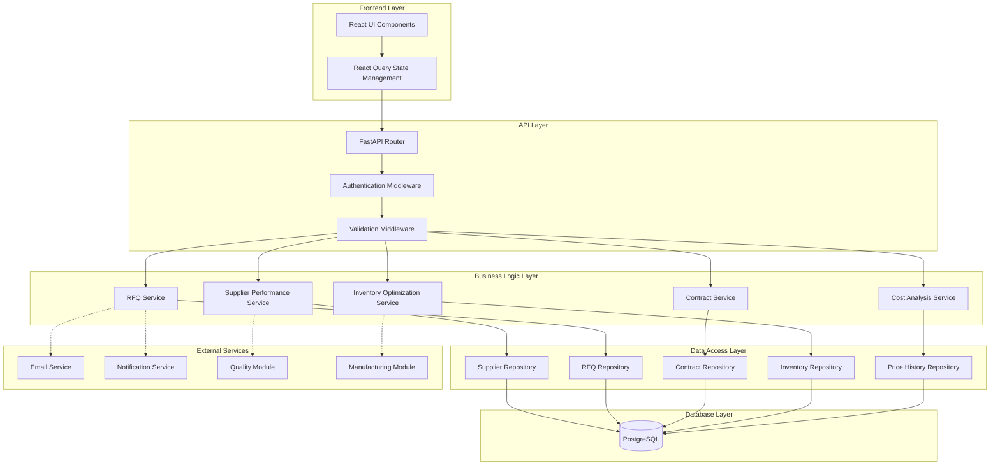

# Advanced Procurement & Supplier Management - Design Document

**Document Version:** 1.0  
**Date:** November 25, 2025  
**Status:** Draft for Review  
**Project:** MTO360 - Advanced Procurement Module

---

## Table of Contents

1. [System Architecture](#1-system-architecture)
2. [Module Design](#2-module-design)
3. [API Specification](#3-api-specification)
4. [Service Layer Design](#4-service-layer-design)
5. [Frontend Architecture](#5-frontend-architecture)
6. [Integration Architecture](#6-integration-architecture)
7. [Security Design](#7-security-design)
8. [Performance Optimization](#8-performance-optimization)

---

## 1. System Architecture

### 1.1 High-Level Architecture



### 1.2 Technology Stack

| Layer | Technology | Version | Purpose |
|-------|-----------|---------|---------|
| **Frontend** | React | 18+ | UI framework |
| | TypeScript | 5+ | Type safety |
| | Ant Design | 5+ | UI components |
| | React Query | 4+ | Data fetching & caching |
| | React Router | 6+ | Navigation |
| | Recharts | 2+ | Analytics charts |
| **Backend** | Python | 3.11+ | Programming language |
| | FastAPI | 0.104+ | API framework |
| | SQLAlchemy | 2.0+ | ORM |
| | Alembic | 1.12+ | Database migrations |
| | Pydantic | 2.0+ | Data validation |
| | Celery | 5.3+ | Background jobs |
| **Database** | PostgreSQL | 14+ | Primary database |
| | Redis | 7+ | Caching & Celery broker |
| **Infrastructure** | Docker | 24+ | Containerization |
| | Docker Compose | 2.0+ | Local development |

---

## 2. Module Design

### 2.1 Directory Structure

```
backend/app/modules/procurement/
├── __init__.py
├── api/
│   ├── __init__.py
│   ├── router.py                    # Main router registration
│   ├── supplier_performance.py      # Supplier performance endpoints
│   ├── rfqs.py                      # RFQ endpoints
│   ├── contracts.py                 # Contract endpoints
│   ├── inventory_optimization.py    # Inventory policy endpoints
│   └── cost_analysis.py             # Cost analysis endpoints
│
├── application/
│   ├── __init__.py
│   └── services/
│       ├── __init__.py
│       ├── supplier_performance_service.py
│       ├── rfq_service.py
│       ├── contract_service.py
│       ├── inventory_optimization_service.py
│       └── cost_analysis_service.py
│
├── domain/
│   ├── __init__.py
│   ├── interfaces.py                # Repository interfaces
│   └── calculations/
│       ├── __init__.py
│       ├── reorder_point.py         # ROP calculation
│       ├── economic_order_qty.py    # EOQ calculation
│       ├── abc_analysis.py          # ABC classification
│       └── demand_forecast.py       # Forecasting algorithms
│
├── infra/
│   ├── __init__.py
│   └── repositories/
│       ├── __init__.py
│       ├── supplier_performance_repo.py
│       ├── rfq_repo.py
│       ├── contract_repo.py
│       ├── inventory_policy_repo.py
│       └── price_history_repo.py
│
└── tasks/
    ├── __init__.py
    ├── performance_calculation.py   # Monthly performance calc
    ├── auto_pr_generation.py        # Daily auto-PR job
    ├── contract_expiration.py       # Contract expiration alerts
    └── budget_updates.py            # Budget tracking updates
```

**Frontend Structure:**

```
client/src/features/procurement/
├── api/
│   ├── supplierPerformanceApi.ts
│   ├── rfqApi.ts
│   ├── contractApi.ts
│   ├── inventoryPolicyApi.ts
│   └── costAnalysisApi.ts
│
├── components/
│   ├── SupplierPerformance/
│   │   ├── SupplierScorecard.tsx
│   │   ├── PerformanceTrendsChart.tsx
│   │   └── SupplierRankings.tsx
│   │
│   ├── RFQ/
│   │   ├── RFQForm.tsx
│   │   ├── RFQList.tsx
│   │   ├── QuoteComparisonTable.tsx
│   │   └── AwardDecisionModal.tsx
│   │
│   ├── Contracts/
│   │   ├── ContractForm.tsx
│   │   ├── ContractList.tsx
│   │   ├── VolumeDiscountManager.tsx
│   │   └── ExpiringContractsWidget.tsx
│   │
│   ├── InventoryOptimization/
│   │   ├── InventoryPolicyForm.tsx
│   │   ├── BelowROPList.tsx
│   │   ├── ABCAnalysisChart.tsx
│   │   └── DemandForecastChart.tsx
│   │
│   └── CostAnalysis/
│       ├── PriceTrendChart.tsx
│       ├── SpendAnalysisDashboard.tsx
│       ├── BudgetTracker.tsx
│       └── CostVarianceReport.tsx
│
├── pages/
│   ├── SupplierPerformancePage.tsx
│   ├── RFQListPage.tsx
│   ├── RFQDetailPage.tsx
│   ├── ContractListPage.tsx
│   ├── ContractDetailPage.tsx
│   ├── InventoryOptimizationPage.tsx
│   └── CostAnalysisPage.tsx
│
├── hooks/
│   ├── useSupplierPerformance.ts
│   ├── useRFQs.ts
│   ├── useContracts.ts
│   ├── useInventoryPolicies.ts
│   └── useCostAnalysis.ts
│
└── types/
    ├── supplier.ts
    ├── rfq.ts
    ├── contract.ts
    ├── inventory.ts
    └── cost.ts
```

---

## 3. API Specification

### 3.1 API Design Principles

- **RESTful**: Follow REST conventions (GET, POST, PUT, DELETE)
- **Versioned**: All endpoints under `/api/v1/procurement/`
- **Consistent**: Uniform response format, error handling
- **Documented**: OpenAPI/Swagger documentation
- **Secure**: JWT authentication, role-based authorization

### 3.2 Response Format

**Success Response:**
```json
{
  "data": { /* resource data */ },
  "message": "Success message",
  "timestamp": "2025-11-25T12:00:00Z"
}
```

**Error Response:**
```json
{
  "error": {
    "code": "VALIDATION_ERROR",
    "message": "Validation failed",
    "details": [
      {
        "field": "quantity",
        "message": "Must be greater than 0"
      }
    ]
  },
  "timestamp": "2025-11-25T12:00:00Z"
}
```

### 3.3 API Endpoints Specification

#### 3.3.1 Supplier Performance Management

```python
# GET /api/v1/procurement/suppliers/{supplier_id}/performance
@router.get("/suppliers/{supplier_id}/performance")
async def get_supplier_performance(
    supplier_id: int,
    start_date: Optional[date] = None,
    end_date: Optional[date] = None,
    db: AsyncSession = Depends(get_db)
) -> SupplierPerformanceResponse:
    """
    Get supplier performance metrics
    
    Query Parameters:
    - start_date: Filter from date (default: 6 months ago)
    - end_date: Filter to date (default: today)
    
    Returns:
    - List of monthly performance records
    - Latest overall score
    - Trend indicator (improving/declining)
    """
```

```python
# GET /api/v1/procurement/suppliers/rankings
@router.get("/suppliers/rankings")
async def get_supplier_rankings(
    category_id: Optional[int] = None,
    limit: int = 10,
    db: AsyncSession = Depends(get_db)
) -> List[SupplierRankingResponse]:
    """
    Get supplier rankings by overall score
    
    Query Parameters:
    - category_id: Filter by component category
    - limit: Number of top suppliers (default: 10)
    
    Returns:
    - Ranked list of suppliers with scores
    """
```

```python
# POST /api/v1/procurement/suppliers/{supplier_id}/performance/calculate
@router.post("/suppliers/{supplier_id}/performance/calculate")
async def calculate_supplier_performance(
    supplier_id: int,
    period: date,
    db: AsyncSession = Depends(get_db),
    current_user: User = Depends(get_current_user)
) -> SupplierPerformanceResponse:
    """
    Manually trigger performance calculation
    
    Request Body:
    - period: Month for calculation (first day of month)
    
    Returns:
    - Calculated performance record
    
    Permissions: procurement_manager
    """
```

#### 3.3.2 RFQ & Bidding

```python
# POST /api/v1/procurement/rfqs
@router.post("/rfqs", status_code=201)
async def create_rfq(
    data: RFQCreateSchema,
    db: AsyncSession = Depends(get_db),
    current_user: User = Depends(get_current_user)
) -> RFQResponse:
    """
    Create new RFQ
    
    Request Body:
    {
      "component_id": 123,
      "quantity": 1000,
      "required_by_date": "2025-12-31",
      "closing_datetime": "2025-12-15T17:00:00Z",
      "specifications": "Technical specs...",
      "internal_notes": "Internal notes...",
      "supplier_ids": [1, 2, 3]  // Suppliers to send RFQ
    }
    
    Returns:
    - Created RFQ with generated rfq_number
    
    Permissions: buyer, procurement_manager
    """
```

```python
# POST /api/v1/procurement/rfqs/{rfq_id}/send
@router.post("/rfqs/{rfq_id}/send")
async def send_rfq(
    rfq_id: int,
    db: AsyncSession = Depends(get_db),
    current_user: User = Depends(get_current_user)
) -> RFQResponse:
    """
    Send RFQ to selected suppliers
    
    Actions:
    - Validate RFQ status is DRAFT
    - Send email to all selected suppliers
    - Update status to SENT
    - Create notification for procurement team
    
    Returns:
    - Updated RFQ
    
    Permissions: buyer, procurement_manager
    """
```

```python
# POST /api/v1/procurement/rfqs/{rfq_id}/quotes
@router.post("/rfqs/{rfq_id}/quotes")
async def submit_quote(
    rfq_id: int,
    data: QuoteCreateSchema,
    db: AsyncSession = Depends(get_db),
    current_user: User = Depends(get_current_user)
) -> QuoteResponse:
    """
    Submit supplier quote for RFQ
    
    Request Body:
    {
      "supplier_id": 1,
      "unit_price": 12.50,
      "lead_time_days": 30,
      "minimum_order_quantity": 100,
      "quote_valid_until": "2025-12-31",
      "notes": "Optional notes"
    }
    
    Returns:
    - Created quote
    
    Permissions: buyer, procurement_manager (or supplier via portal)
    """
```

```python
# GET /api/v1/procurement/rfqs/{rfq_id}/quotes/compare
@router.get("/rfqs/{rfq_id}/quotes/compare")
async def compare_quotes(
    rfq_id: int,
    sort_by: Literal["price", "lead_time", "score"] = "price",
    db: AsyncSession = Depends(get_db)
) -> QuoteComparisonResponse:
    """
    Compare all quotes for an RFQ
    
    Query Parameters:
    - sort_by: Sort criteria (price, lead_time, score)
    
    Returns:
    {
      "rfq": { /* RFQ details */ },
      "quotes": [
        {
          "quote_id": 1,
          "supplier": { /* supplier details */ },
          "unit_price": 12.50,
          "total_price": 12500.00,
          "lead_time_days": 30,
          "delivery_date": "2026-01-15",
          "moq": 100,
          "supplier_score": 85,
          "is_best_price": true,
          "is_best_lead_time": false
        }
      ],
      "recommendation": "Supplier ABC (best price + high score)"
    }
    """
```

```python
# POST /api/v1/procurement/rfqs/{rfq_id}/award
@router.post("/rfqs/{rfq_id}/award")
async def award_rfq(
    rfq_id: int,
    data: RFQAwardSchema,
    db: AsyncSession = Depends(get_db),
    current_user: User = Depends(get_current_user)
) -> RFQAwardResponse:
    """
    Award RFQ to winning supplier
    
    Request Body:
    {
      "quote_id": 123,
      "justification": "Best price and delivery time"
    }
    
    Actions:
    - Update quote status to ACCEPTED
    - Update other quotes to REJECTED
    - Create Purchase Order from quote
    - Send notifications to suppliers
    - Update RFQ status to AWARDED
    
    Returns:
    - Created PO details
    
    Permissions: procurement_manager
    """
```

#### 3.3.3 Contract Management

```python
# POST /api/v1/procurement/contracts
@router.post("/contracts", status_code=201)
async def create_contract(
    data: ContractCreateSchema,
    db: AsyncSession = Depends(get_db),
    current_user: User = Depends(get_current_user)
) -> ContractResponse:
    """
    Create supplier contract
    
    Request Body:
    {
      "supplier_id": 1,
      "start_date": "2025-01-01",
      "end_date": "2025-12-31",
      "payment_terms": "Net 30",
      "volume_discounts": [
        {"min_qty": 1, "max_qty": 99, "discount_pct": 0},
        {"min_qty": 100, "max_qty": 499, "discount_pct": 5},
        {"min_qty": 500, "max_qty": null, "discount_pct": 10}
      ],
      "auto_renew": false,
      "renewal_notice_days": 90,
      "pricing": [
        {
          "component_id": 123,
          "unit_price": 10.00,
          "minimum_order_quantity": 100,
          "lead_time_days": 30
        }
      ]
    }
    
    Returns:
    - Created contract with generated contract_number
    
    Permissions: procurement_manager
    """
```

```python
# GET /api/v1/procurement/contracts/expiring
@router.get("/contracts/expiring")
async def get_expiring_contracts(
    days: int = 30,
    db: AsyncSession = Depends(get_db)
) -> List[ContractResponse]:
    """
    Get contracts expiring within X days
    
    Query Parameters:
    - days: Number of days (default: 30)
    
    Returns:
    - List of contracts expiring soon
    - Days until expiration
    """
```

#### 3.3.4 Inventory Optimization

```python
# POST /api/v1/procurement/inventory-policies/{component_id}/calculate-rop
@router.post("/inventory-policies/{component_id}/calculate-rop")
async def calculate_reorder_point(
    component_id: int,
    service_level: float = 0.95,
    db: AsyncSession = Depends(get_db),
    current_user: User = Depends(get_current_user)
) -> InventoryPolicyResponse:
    """
    Calculate optimal reorder point for component
    
    Query Parameters:
    - service_level: Desired service level (0.0-1.0, default: 0.95)
    
    Calculation:
    - Average daily demand from last 90 days
    - Demand std dev for safety stock
    - Supplier lead time
    - ROP = (avg_daily_demand × lead_time) + safety_stock
    
    Returns:
    - Updated inventory policy with calculated ROP
    
    Permissions: warehouse_manager, procurement_manager
    """
```

```python
# GET /api/v1/procurement/components/below-reorder-point
@router.get("/components/below-reorder-point")
async def get_components_below_rop(
    db: AsyncSession = Depends(get_db)
) -> List[ComponentBelowROPResponse]:
    """
    Get all components below reorder point
    
    Returns:
    [
      {
        "component_id": 123,
        "component_name": "Resistor 10K",
        "current_stock": 50,
        "reorder_point": 100,
        "safety_stock": 20,
        "recommended_order_qty": 500,  // EOQ
        "priority": "high",  // based on how far below ROP
        "has_pending_pr": false
      }
    ]
    """
```

```python
# POST /api/v1/procurement/auto-generate-prs
@router.post("/auto-generate-prs")
async def auto_generate_prs(
    db: AsyncSession = Depends(get_db),
    current_user: User = Depends(get_current_user)
) -> AutoPRGenerationResponse:
    """
    Manually trigger auto-PR generation
    
    Actions:
    - Check all components with auto_pr_enabled
    - For each component below ROP:
      - Check no existing pending PR
      - Create PR with qty = EOQ
      - Set priority based on urgency
    
    Returns:
    {
      "prs_created": 5,
      "components": [...]  // List of components with PRs created
    }
    
    Permissions: procurement_manager
    Note: This also runs automatically via daily cron job
    """
```

```python
# GET /api/v1/procurement/abc-analysis
@router.get("/abc-analysis")
async def get_abc_analysis(
    category_id: Optional[int] = None,
    db: AsyncSession = Depends(get_db)
) -> ABCAnalysisResponse:
    """
    Get ABC analysis results
    
    Query Parameters:
    - category_id: Filter by category
    
    Returns:
    {
      "total_components": 1000,
      "total_annual_value": 1000000.00,
      "classification": {
        "A": {
          "count": 200,        // 20% of items
          "value": 750000.00,  // 75% of value
          "percentage": 75.0
        },
        "B": { /* ... */ },
        "C": { /* ... */ }
      },
      "components": [
        {
          "component_id": 123,
          "component_name": "...",
          "annual_usage": 10000,
          "unit_cost": 50.00,
          "annual_value": 500000.00,
          "classification": "A",
          "cumulative_percentage": 50.0
        }
      ]
    }
    """
```

#### 3.3.5 Cost Analysis

```python
# GET /api/v1/procurement/price-history
@router.get("/price-history")
async def get_price_history(
    component_id: int,
    supplier_id: Optional[int] = None,
    start_date: Optional[date] = None,
    end_date: Optional[date] = None,
    db: AsyncSession = Depends(get_db)
) -> PriceHistoryResponse:
    """
    Get price history for component
    
    Query Parameters:
    - component_id: Required
    - supplier_id: Optional filter by supplier
    - start_date: Default 12 months ago
    - end_date: Default today
    
    Returns:
    {
      "component": { /* component details */ },
      "history": [
        {
          "date": "2025-01-15",
          "price": 12.50,
          "supplier": "Supplier ABC",
          "source": "purchase_order",
          "change_pct": 5.0  // % change from previous
        }
      ],
      "trend": "increasing",
      "avg_price": 12.00,
      "min_price": 10.00,
      "max_price": 15.00,
      "price_volatility": 12.5  // std dev %
    }
    """
```

```python
# GET /api/v1/procurement/spend-analysis
@router.get("/spend-analysis")
async def get_spend_analysis(
    start_date: date,
    end_date: date,
    group_by: Literal["supplier", "category", "month"] = "supplier",
    db: AsyncSession = Depends(get_db)
) -> SpendAnalysisResponse:
    """
    Analyze procurement spend
    
    Query Parameters:
    - start_date: Required
    - end_date: Required
    - group_by: Group results by (supplier, category, month)
    
    Returns:
    {
      "total_spend": 500000.00,
      "period": {"start": "2025-01-01", "end": "2025-11-25"},
      "breakdown": [
        {
          "name": "Supplier ABC",
          "spend": 100000.00,
          "percentage": 20.0,
          "order_count": 50,
          "avg_order_value": 2000.00
        }
      ],
      "top_10_suppliers": [...],
      "concentration": {
        "top_3_pct": 60.0,  // % spend with top 3 suppliers
        "top_10_pct": 85.0
      }
    }
    """
```

```python
# GET /api/v1/procurement/budget-tracking
@router.get("/budget-tracking")
async def get_budget_tracking(
    fiscal_year: int,
    category_id: Optional[int] = None,
    db: AsyncSession = Depends(get_db)
) -> BudgetTrackingResponse:
    """
    Track budget vs actual spend
    
    Query Parameters:
    - fiscal_year: Required
    - category_id: Optional filter
    
    Returns:
    {
      "fiscal_year": 2025,
      "budgets": [
        {
          "category": "Electronics",
          "budgeted": 100000.00,
          "actual": 85000.00,
          "variance": 15000.00,
          "variance_pct": 15.0,
          "consumed_pct": 85.0,
          "status": "on_track",  // on_track, at_risk, over_budget
          "projected_annual": 102000.00  // based on current trend
        }
      ],
      "overall": {
        "total_budget": 500000.00,
        "total_actual": 425000.00,
        "consumed_pct": 85.0
      }
    }
    """
```

---

## 4. Service Layer Design

### 4.1 Service Architecture Patterns

**Dependency Injection:**
```python
class SupplierPerformanceService:
    def __init__(
        self,
        db: AsyncSession,
        repo: SupplierPerformanceRepository,
        quality_service: QualityService
    ):
        self.db = db
        self.repo = repo
        self.quality_service = quality_service
```

**Transaction Management:**
```python
class RFQService:
    async def award_rfq(self, rfq_id: int, quote_id: int) -> PurchaseOrder:
        async with self.db.begin():  # Transaction
            # Update quote status
            await self.update_quote_status(quote_id, QuoteStatus.ACCEPTED)
            
            # Create PO
            po = await self.create_po_from_quote(quote_id)
            
            # Update RFQ status
            await self.update_rfq_status(rfq_id, RFQStatus.AWARDED)
            
            # Send notifications (queued, outside transaction)
            await self.notification_service.notify_award(rfq_id, quote_id)
            
            return po
```

### 4.2 Calculation Services

#### 4.2.1 Reorder Point Calculation

```python
# domain/calculations/reorder_point.py

from dataclasses import dataclass
from decimal import Decimal
import math
from typing import List

@dataclass
class DemandData:
    daily_demands: List[int]  # Last 90 days
    lead_time_days: int
    service_level: float = 0.95  # 95% service level

class ReorderPointCalculator:
    """Calculate optimal reorder point (ROP)"""
    
    # Z-scores for common service levels
    Z_SCORES = {
        0.90: 1.28,
        0.95: 1.65,
        0.99: 2.33
    }
    
    def calculate(self, demand_data: DemandData) -> dict:
        """
        Calculate ROP, safety stock, and reorder quantity
        
        Formula:
        ROP = (Average Daily Demand × Lead Time) + Safety Stock
        Safety Stock = Z-score × σ × √Lead Time
        
        Returns:
        {
          "reorder_point": 150,
          "safety_stock": 50,
          "average_daily_demand": 10.0,
          "demand_std_dev": 2.5,
          "service_level": 0.95
        }
        """
        if not demand_data.daily_demands:
            return {
                "reorder_point": 0,
                "safety_stock": 0,
                "average_daily_demand": 0.0,
                "demand_std_dev": 0.0,
                "service_level": demand_data.service_level
            }
        
        # Calculate average daily demand
        avg_daily_demand = sum(demand_data.daily_demands) / len(demand_data.daily_demands)
        
        # Calculate demand standard deviation
        variance = sum((x - avg_daily_demand) ** 2 for x in demand_data.daily_demands) / len(demand_data.daily_demands)
        std_dev = math.sqrt(variance)
        
        # Get Z-score for service level
        z_score = self.Z_SCORES.get(demand_data.service_level, 1.65)
        
        # Calculate safety stock
        # SS = Z × σ × √LT
        safety_stock = z_score * std_dev * math.sqrt(demand_data.lead_time_days)
        
        # Calculate ROP
        # ROP = (Avg Daily Demand × Lead Time) + Safety Stock
        reorder_point = (avg_daily_demand * demand_data.lead_time_days) + safety_stock
        
        return {
            "reorder_point": int(round(reorder_point)),
            "safety_stock": int(round(safety_stock)),
            "average_daily_demand": round(avg_daily_demand, 2),
            "demand_std_dev": round(std_dev, 2),
            "service_level": demand_data.service_level
        }
```

#### 4.2.2 Economic Order Quantity (EOQ)

```python
# domain/calculations/economic_order_qty.py

import math
from decimal import Decimal

@dataclass
class EOQInputs:
    annual_demand: int
    ordering_cost: Decimal  # Cost per order ($)
    holding_cost_pct: Decimal  # % of unit cost per year
    unit_cost: Decimal

class EOQCalculator:
    """Calculate Economic Order Quantity"""
    
    def calculate(self, inputs: EOQInputs) -> dict:
        """
        Calculate optimal order quantity
        
        Formula:
        EOQ = √[(2 × Annual Demand × Ordering Cost) / Holding Cost per Unit]
        Holding Cost per Unit = Unit Cost × Holding Cost %
        
        Returns:
        {
          "economic_order_quantity": 500,
          "orders_per_year": 20,
          "time_between_orders_days": 18,
          "total_ordering_cost": 1000.00,
          "total_holding_cost": 1000.00,
          "total_cost": 2000.00
        }
        """
        if inputs.annual_demand == 0 or inputs.ordering_cost == 0 or inputs.unit_cost == 0:
            return {
                "economic_order_quantity": 0,
                "orders_per_year": 0,
                "time_between_orders_days": 0,
                "total_ordering_cost": Decimal("0.00"),
                "total_holding_cost": Decimal("0.00"),
                "total_cost": Decimal("0.00")
            }
        
        # Calculate holding cost per unit
        holding_cost_per_unit = inputs.unit_cost * (inputs.holding_cost_pct / 100)
        
        # Calculate EOQ
        # EOQ = √[(2 × D × S) / H]
        eoq = math.sqrt(
            (2 * inputs.annual_demand * float(inputs.ordering_cost)) /
            float(holding_cost_per_unit)
        )
        eoq = int(round(eoq))
        
        # Calculate derived metrics
        orders_per_year = inputs.annual_demand / eoq if eoq > 0 else 0
        time_between_orders = 365 / orders_per_year if orders_per_year > 0 else 0
        
        # Calculate costs
        total_ordering_cost = Decimal(str(orders_per_year)) * inputs.ordering_cost
        total_holding_cost = Decimal(str(eoq / 2)) * holding_cost_per_unit
        total_cost = total_ordering_cost + total_holding_cost
        
        return {
            "economic_order_quantity": eoq,
            "orders_per_year": round(orders_per_year, 2),
            "time_between_orders_days": round(time_between_orders, 2),
            "total_ordering_cost": round(total_ordering_cost, 2),
            "total_holding_cost": round(total_holding_cost, 2),
            "total_cost": round(total_cost, 2)
        }
```

#### 4.2.3 ABC Analysis

```python
# domain/calculations/abc_analysis.py

from dataclasses import dataclass
from typing import List
from decimal import Decimal

@dataclass
class ComponentValue:
    component_id: int
    annual_usage: int
    unit_cost: Decimal
    annual_value: Decimal  # usage × cost

class ABCAnalyzer:
    """Perform ABC inventory classification"""
    
    def classify(self, components: List[ComponentValue]) -> dict:
        """
        Classify components using ABC analysis
        
        Class A: Top 20% of items by value (typically 70-80% of total value)
        Class B: Next 30% of items (typically 15-20% of total value)
        Class C: Remaining 50% of items (typically 5-10% of total value)
        
        Returns:
        {
          "total_components": 1000,
          "total_value": 1000000.00,
          "classifications": {
            "A": {"count": 200, "value": 750000.00, "percentage": 75.0},
            "B": {"count": 300, "value": 200000.00, "percentage": 20.0},
            "C": {"count": 500, "value": 50000.00, "percentage": 5.0}
          },
          "components": [
            {
              "component_id": 123,
              "annual_value": 100000.00,
              "cumulative_value": 100000.00,
              "cumulative_percentage": 10.0,
              "classification": "A"
            }
          ]
        }
        """
        if not components:
            return self._empty_result()
        
        # Sort by annual value descending
        sorted_components = sorted(
            components,
            key=lambda c: c.annual_value,
            reverse=True
        )
        
        total_value = sum(c.annual_value for c in sorted_components)
        total_count = len(sorted_components)
        
        # Calculate cumulative percentages and classify
        cumulative_value = Decimal("0.00")
        results = []
        
        for comp in sorted_components:
            cumulative_value += comp.annual_value
            cumulative_pct = (cumulative_value / total_value * 100) if total_value > 0 else 0
            
            # Classify based on cumulative percentage
            if cumulative_pct <= 80:
                classification = "A"
            elif cumulative_pct <= 95:
                classification = "B"
            else:
                classification = "C"
            
            results.append({
                "component_id": comp.component_id,
                "annual_value": comp.annual_value,
                "cumulative_value": cumulative_value,
                "cumulative_percentage": round(cumulative_pct, 2),
                "classification": classification
            })
        
        # Calculate class summaries
        class_a = [r for r in results if r["classification"] == "A"]
        class_b = [r for r in results if r["classification"] == "B"]
        class_c = [r for r in results if r["classification"] == "C"]
        
        return {
            "total_components": total_count,
            "total_value": total_value,
            "classifications": {
                "A": {
                    "count": len(class_a),
                    "value": sum(r["annual_value"] for r in class_a),
                    "percentage": round(sum(r["annual_value"] for r in class_a) / total_value * 100, 2) if total_value > 0 else 0
                },
                "B": {
                    "count": len(class_b),
                    "value": sum(r["annual_value"] for r in class_b),
                    "percentage": round(sum(r["annual_value"] for r in class_b) / total_value * 100, 2) if total_value > 0 else 0
                },
                "C": {
                    "count": len(class_c),
                    "value": sum(r["annual_value"] for r in class_c),
                    "percentage": round(sum(r["annual_value"] for r in class_c) / total_value * 100, 2) if total_value > 0 else 0
                }
            },
            "components": results
        }
    
    def _empty_result(self):
        return {
            "total_components": 0,
            "total_value": Decimal("0.00"),
            "classifications": {
                "A": {"count": 0, "value": Decimal("0.00"), "percentage": 0.0},
                "B": {"count": 0, "value": Decimal("0.00"), "percentage": 0.0},
                "C": {"count": 0, "value": Decimal("0.00"), "percentage": 0.0}
            },
            "components": []
        }
```

---

## 5. Frontend Architecture

### 5.1 State Management

**React Query for Server State:**

```typescript
// hooks/useSupplierPerformance.ts
import { useQuery, useMutation, useQueryClient } from '@tanstack/react-query';
import { supplierPerformanceApi } from '../api/supplierPerformanceApi';

export const useSupplierPerformance = (supplierId: number) => {
  return useQuery({
    queryKey: ['supplier-performance', supplierId],
    queryFn: () => supplierPerformanceApi.getPerformance(supplierId),
    staleTime: 5 * 60 * 1000, // 5 minutes
  });
};

export const useCalculatePerformance = () => {
  const queryClient = useQueryClient();
  
  return useMutation({
    mutationFn: (data: { supplierId: number; period: string }) =>
      supplierPerformanceApi.calculatePerformance(data.supplierId, data.period),
    onSuccess: (_, variables) => {
      // Invalidate performance query to refetch
      queryClient.invalidateQueries(['supplier-performance', variables.supplierId]);
    },
  });
};
```

### 5.2 Component Design Patterns

**Container/Presenter Pattern:**

```typescript
// pages/RFQDetailPage.tsx (Container)
export const RFQDetailPage: React.FC = () => {
  const { rfqId } = useParams<{ rfqId: string }>();
  const { data: rfq, isLoading } = useRFQ(Number(rfqId));
  const { data: quotes } = useRFQQuotes(Number(rfqId));
  const awardMutation = useAwardRFQ();
  
  const handleAward = (quoteId: number, justification: string) => {
    awardMutation.mutate({ rfqId: Number(rfqId), quoteId, justification });
  };
  
  if (isLoading) return <Spin />;
  if (!rfq) return <NotFound />;
  
  return (
    <RFQDetail 
      rfq={rfq}
      quotes={quotes}
      onAward={handleAward}
      isAwarding={awardMutation.isLoading}
    />
  );
};

// components/RFQ/RFQDetail.tsx (Presenter)
interface RFQDetailProps {
  rfq: RFQ;
  quotes: Quote[];
  onAward: (quoteId: number, justification: string) => void;
  isAwarding: boolean;
}

export const RFQDetail: React.FC<RFQDetailProps> = ({
  rfq,
  quotes,
  onAward,
  isAwarding
}) => {
  return (
    <Card>
      <RFQHeader rfq={rfq} />
      <QuoteComparisonTable quotes={quotes} onAward={onAward} />
      {/* ... */}
    </Card>
  );
};
```

### 5.3 Routing Structure

```typescript
// App.tsx
import { Routes, Route } from 'react-router-dom';

<Routes>
  {/* Procurement Routes */}
  <Route path="/procurement" element={<ProcurementLayout />}>
    {/* Supplier Performance */}
    <Route path="suppliers/:supplierId/performance" element={<SupplierPerformancePage />} />
    <Route path="suppliers/rankings" element={<SupplierRankingsPage />} />
    
    {/* RFQs */}
    <Route path="rfqs" element={<RFQListPage />} />
    <Route path="rfqs/new" element={<RFQCreatePage />} />
    <Route path="rfqs/:rfqId" element={<RFQDetailPage />} />
    
    {/* Contracts */}
    <Route path="contracts" element={<ContractListPage />} />
    <Route path="contracts/new" element={<ContractCreatePage />} />
    <Route path="contracts/:contractId" element={<ContractDetailPage />} />
    
    {/* Inventory Optimization */}
    <Route path="inventory-optimization" element={<InventoryOptimizationPage />} />
    
    {/* Cost Analysis */}
    <Route path="cost-analysis" element={<CostAnalysisPage />} />
  </Route>
</Routes>
```

---

## 6. Integration Architecture

### 6.1 Integration Patterns

**Event-Driven Integration:**
```python
# Emit events for other modules to consume
class RFQService:
    async def award_rfq(self, rfq_id: int, quote_id: int):
        # ... award logic ...
        
        # Emit event
        await self.event_bus.publish(
            "procurement.rfq.awarded",
            {
                "rfq_id": rfq_id,
                "quote_id": quote_id,
                "supplier_id": quote.supplier_id,
                "component_id": rfq.component_id,
                "unit_price": quote.unit_price
            }
        )
```

**Service-to-Service Calls:**
```python
# procurement module calls quality module
class SupplierPerformanceService:
    def __init__(self, quality_service: QualityService):
        self.quality_service = quality_service
    
    async def calculate_performance(self, supplier_id: int, period: date):
        # Get quality rating from quality module
        quality_data = await self.quality_service.get_supplier_quality(
            supplier_id=supplier_id,
            start_date=period,
            end_date=period + timedelta(days=30)
        )
        
        quality_rating = quality_data.get("defect_rate_score", 100)  # 0-100
        
        # ... calculate other metrics ...
```

---

## 7. Security Design

### 7.1 Authentication Flow

1. User logs in → JWT token issued
2. Frontend stores token in httpOnly cookie
3. API requests include token in Authorization header
4. Middleware validates token and extracts user
5. Endpoint checks user permissions

### 7.2 Authorization Matrix

| Endpoint | Public | Buyer | Warehouse Mgr | Procurement Mgr | Finance Mgr |
|----------|--------|-------|---------------|-----------------|-------------|
| GET /suppliers/performance | ❌ | ✅ | ✅ | ✅ | ✅ |
| POST /rfqs | ❌ | ✅ | ❌ | ✅ | ❌ |
| POST /rfqs/{id}/send | ❌ | ✅ | ❌ | ✅ | ❌ |
| POST /rfqs/{id}/award | ❌ | ❌ | ❌ | ✅ | ❌ |
| POST /contracts | ❌ | ❌ | ❌ | ✅ | ❌ |
| PUT /inventory-policies | ❌ | ✅ | ✅ | ✅ | ❌ |
| GET /cost-analysis | ❌ | ✅ | ❌ | ✅ | ✅ |
| POST /budgets | ❌ | ❌ | ❌ | ✅ | ✅ |

---

## 8. Performance Optimization

### 8.1 Database Optimization

**Indexes:**
- Primary keys on all tables
- Foreign keys indexed
- Composite indexes on frequently queried columns
- Partial indexes for filtered queries

**Query Optimization:**
```python
# Bad: N+1 query problem
for rfq in rfqs:
    quotes = await get_quotes(rfq.id)  # N queries

# Good: Eager loading
rfqs_with_quotes = await db.execute(
    select(RFQ)
    .options(joinedload(RFQ.quotes))
    .where(RFQ.status == RFQStatus.SENT)
)
```

### 8.2 Caching Strategy

**Redis Caching:**
```python
# Cache frequently accessed data
@cached(ttl=300)  # 5 minutes
async def get_supplier_rankings(category_id: Optional[int] = None):
    # Expensive query
    return await db.execute(...)

# Invalidate cache on update
async def calculate_performance(supplier_id: int):
    # ... calculation ...
    await cache.delete(f"supplier_rankings:*")
```

### 8.3 Background Jobs (Celery)

```python
# tasks/performance_calculation.py
from celery import Celery

celery_app = Celery('procurement', broker='redis://localhost:6379/0')

@celery_app.task
def calculate_monthly_performance():
    """Run monthly performance calculations for all suppliers"""
    # Runs via cron: 0 2 1 * * (1st of month at 2 AM)
    service = SupplierPerformanceService(db)
    last_month = date.today().replace(day=1) - timedelta(days=1)
    
    suppliers = service.get_all_active_suppliers()
    for supplier in suppliers:
        service.calculate_performance(supplier.id, last_month)

@celery_app.task
def generate_auto_prs():
    """Daily job to generate purchase requisitions"""
    # Runs via cron: 0 8 * * * (daily at 8 AM)
    service = InventoryOptimizationService(db)
    service.auto_generate_prs()
```

---

**Document Status:** DRAFT - Pending Technical Review

**Next Steps:**
1. Review by Technical Lead
2. Review by Frontend Lead
3. Validation of design patterns
4. Approval for implementation
