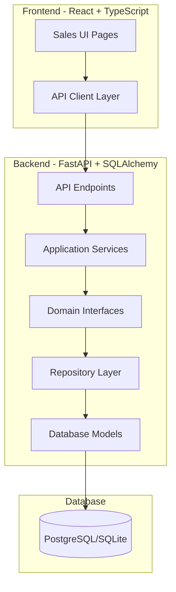

# Design Document

## Overview

This design document outlines the implementation of an Enterprise Make-to-Order (MTO) Sales Management System that enables complete sales lifecycle management from RFQ through Quotation to Sales Order. The system follows a clean architecture pattern with separation of concerns across API, application services, domain logic, and infrastructure layers.

### Key Design Principles

1. **Document Workflow**: RFQ → Quotation → Sales Order with proper status transitions
2. **Dual Entry Points**: Support both RFQ-initiated and direct quotation creation
3. **Immutability**: Lock documents after certain status transitions to maintain audit trail
4. **Traceability**: Maintain bidirectional references between related documents
5. **Validation**: Enforce business rules at service layer before persistence

### System Context

The MTO Sales Flow integrates with:
- **Manufacturing Module**: Sales orders trigger manufacturing order creation
- **Inventory Module**: Product availability checks and BOM validation
- **Notification Module**: Status change notifications to stakeholders
- **User Module**: Authentication and authorization for sales operations

## Architecture

### High-Level Architecture



### Backend Architecture Layers

#### 1. API Layer (`backend/app/modules/sales/api/`)
- RESTful endpoints for RFQs, Quotations, and Sales Orders
- Request validation using Pydantic schemas
- Authentication and authorization middleware
- HTTP status code management

#### 2. Application Services Layer (`backend/app/modules/sales/application/services/`)
- Business logic orchestration
- Transaction management
- Cross-entity operations (e.g., RFQ to Quotation conversion)
- Status transition validation

#### 3. Domain Layer (`backend/app/modules/sales/domain/`)
- Repository interfaces
- Business rule definitions
- Domain events (future enhancement)

#### 4. Infrastructure Layer (`backend/app/modules/sales/infra/repositories/`)
- Repository implementations
- Database query optimization
- Data access patterns

### Frontend Architecture

#### Component Structure

```
client/src/features/sales/
├── api/
│   └── index.ts                    # API client functions
├── pages/
│   ├── RfqsPage.tsx               # RFQ list and management
│   ├── RfqDetailPage.tsx          # RFQ detail view (NEW)
│   ├── QuotationsPage.tsx         # Quotation list (ENHANCED)
│   ├── QuotationDetailPage.tsx    # Quotation detail view (NEW)
│   ├── SalesOrdersPage.tsx        # Sales order list (ENHANCED)
│   └── SalesOrderDetailPage.tsx   # Sales order detail view (NEW)
├── components/
│   ├── RfqForm.tsx                # RFQ creation/edit form (NEW)
│   ├── QuotationForm.tsx          # Quotation creation/edit form (NEW)
│   ├── SalesOrderForm.tsx         # Sales order creation form (NEW)
│   ├── StatusBadge.tsx            # Status display component (NEW)
│   ├── DocumentLink.tsx           # Document reference links (NEW)
│   └── LineItemsTable.tsx         # Reusable line items table (NEW)
├── hooks/
│   ├── useRfqs.ts                 # RFQ data hooks (NEW)
│   ├── useQuotations.ts           # Quotation data hooks (NEW)
│   └── useSalesOrders.ts          # Sales order data hooks (NEW)
├── types/
│   └── index.ts                   # TypeScript type definitions (ENHANCED)
└── routes/
    └── index.tsx                  # Route configuration (ENHANCED)
```

## Components and Interfaces

### Database Models

#### Enhanced RFQ Model


```python
class RFQ(Base, TimestampMixin):
    id: int
    creator_id: int                    # User who created the RFQ
    status: RFQStatusEnum              # draft, sent, cancelled, completed
    due_date: Optional[datetime]
    description: Optional[str]
    
    # Relationships
    items: List[RFQItem]
    quotations: List[Quotation]        # NEW: Track quotations created from this RFQ
```

#### Enhanced Quotation Model

```python
class Quotation(Base, TimestampMixin):
    id: int
    customer_id: int
    rfq_id: Optional[int]              # NEW: Reference to source RFQ
    date: date
    expiration_date: date
    invoicing_and_shipping_address: str
    total_amount: Decimal
    status: QuotationStatusEnum        # quotation, quotation_sent, accepted, rejected, cancelled, expired
    created_by_id: int
    
    # Relationships
    customer: Customer
    rfq: Optional[RFQ]                 # NEW: Link to source RFQ
    quotation_items: List[QuotationItem]
    sales_orders: List[SalesOrder]     # NEW: Track sales orders created from this quotation
```

#### Enhanced SalesOrder Model

```python
class SalesOrder(Base, TimestampMixin):
    id: int
    customer_id: int
    quotation_id: Optional[int]        # NEW: Reference to source quotation
    total_amount: Decimal
    status: SalesOrderStatusEnum       # pending, confirmed, processing, in_production, ready_for_delivery, cancelled, delivered
    delivery_date: Optional[datetime]  # NEW: Actual delivery timestamp
    
    # Relationships
    customer: Customer
    quotation: Optional[Quotation]     # NEW: Link to source quotation
    order_items: List[SalesOrderItem]
```

### API Endpoints

#### RFQ Endpoints (Enhanced)


```
GET    /api/sales/rfqs                    # List all RFQs with filtering
GET    /api/sales/rfqs/{id}               # Get RFQ details with items
POST   /api/sales/rfqs                    # Create new RFQ
PUT    /api/sales/rfqs/{id}               # Update RFQ (status-dependent)
DELETE /api/sales/rfqs/{id}               # Delete RFQ (draft only)
POST   /api/sales/rfqs/{id}/convert       # NEW: Convert RFQ to Quotation
GET    /api/sales/rfqs/{id}/quotations    # NEW: Get quotations from this RFQ
```

#### Quotation Endpoints (Enhanced)

```
GET    /api/sales/quotations               # List all quotations with filtering
GET    /api/sales/quotations/{id}          # Get quotation details with items
POST   /api/sales/quotations               # Create new quotation (direct or from RFQ)
PUT    /api/sales/quotations/{id}          # Update quotation (status-dependent)
PUT    /api/sales/quotations/{id}/status   # NEW: Update quotation status
DELETE /api/sales/quotations/{id}          # Delete quotation (draft only)
POST   /api/sales/quotations/{id}/convert  # NEW: Convert quotation to sales order
```

#### Sales Order Endpoints (Enhanced)

```
GET    /api/sales/orders                   # List all sales orders with filtering
GET    /api/sales/orders/{id}              # Get sales order details with items
POST   /api/sales/orders                   # Create new sales order (from quotation)
PUT    /api/sales/orders/{id}/status       # NEW: Update sales order status
DELETE /api/sales/orders/{id}              # Cancel sales order (status-dependent)
```

### Service Layer Methods

#### RFQService (Enhanced)

```python
class RFQService:
    async def get_rfqs(skip, limit, status_filter, search) -> List[RFQ]
    async def get_rfq(rfq_id) -> Optional[RFQ]
    async def create_rfq(creator_id, status, due_date, description, items) -> RFQ
    async def update_rfq(rfq_id, **kwargs) -> Optional[RFQ]
    async def delete_rfq(rfq_id) -> bool
    async def convert_to_quotation(rfq_id, customer_id, user_id) -> Quotation  # NEW
    async def get_rfq_quotations(rfq_id) -> List[Quotation]                    # NEW
```

#### QuotationService (Enhanced)


```python
class QuotationService:
    async def get_quotations(skip, limit, status_filter, search) -> List[Quotation]
    async def get_quotation(quotation_id) -> Optional[Quotation]
    async def create_quotation(customer_id, date, expiration_date, address, items, created_by_id, rfq_id=None) -> Quotation
    async def update_quotation(quotation_id, **kwargs) -> Optional[Quotation]
    async def update_quotation_status(quotation_id, new_status, user_id) -> Optional[Quotation]  # NEW
    async def delete_quotation(quotation_id) -> bool
    async def convert_to_sales_order(quotation_id, user_id) -> SalesOrder  # NEW
    async def check_expiration(quotation_id) -> bool                       # NEW
    async def can_edit(quotation_id) -> bool                               # NEW
```

#### SalesOrderService (Enhanced)

```python
class SalesOrderService:
    async def get_sales_orders(skip, limit, status_filter, date_range, search) -> List[SalesOrder]
    async def get_sales_order(order_id) -> Optional[SalesOrder]
    async def create_sales_order(customer_id, order_items, quotation_id=None) -> SalesOrder
    async def update_sales_order_status(order_id, new_status, user_id) -> Optional[SalesOrder]  # NEW
    async def cancel_sales_order(order_id, user_id, reason) -> Optional[SalesOrder]             # NEW
    async def delete_sales_order(order_id) -> bool
    async def can_edit(order_id) -> bool                                                        # NEW
    async def validate_status_transition(current_status, new_status) -> bool                    # NEW
```

## Data Models

### Pydantic Schemas

#### RFQ Schemas (Enhanced)

```python
class RFQItemCreate(BaseModel):
    product_id: int
    quantity: int
    unit_price: Decimal

class RFQCreate(BaseModel):
    status: RFQStatusEnum = RFQStatusEnum.DRAFT
    due_date: Optional[datetime] = None
    description: Optional[str] = None
    items: List[RFQItemCreate]

class RFQUpdate(BaseModel):
    status: Optional[RFQStatusEnum] = None
    due_date: Optional[datetime] = None
    description: Optional[str] = None

class RFQResponse(BaseModel):
    id: int
    creator_id: int
    creator_name: Optional[str] = None  # NEW
    status: RFQStatusEnum
    due_date: Optional[datetime] = None
    description: Optional[str] = None
    created_at: datetime
    updated_at: Optional[datetime] = None
    items: List[RFQItemResponse]
    quotations: List[QuotationSummary] = []  # NEW

class ConvertRFQToQuotationRequest(BaseModel):  # NEW
    customer_id: int
    date: date
    expiration_date: date
    invoicing_and_shipping_address: str
```

#### Quotation Schemas (Enhanced)


```python
class QuotationCreate(BaseModel):
    customer_id: int
    rfq_id: Optional[int] = None  # NEW
    date: date
    expiration_date: date
    invoicing_and_shipping_address: str
    quotation_items: List[QuotationItemCreate]
    status: QuotationStatusEnum = QuotationStatusEnum.QUOTATION

class QuotationStatusUpdate(BaseModel):  # NEW
    status: QuotationStatusEnum

class QuotationResponse(BaseModel):
    id: int
    customer_id: int
    customer_name: Optional[str] = None
    rfq_id: Optional[int] = None  # NEW
    rfq_reference: Optional[RFQSummary] = None  # NEW
    date: date
    expiration_date: date
    invoicing_and_shipping_address: str
    total_amount: Decimal
    status: QuotationStatusEnum
    is_expired: bool  # NEW: Computed field
    can_edit: bool  # NEW: Computed field
    created_by_id: int
    created_at: datetime
    updated_at: Optional[datetime] = None
    quotation_items: List[QuotationItemResponse]
    sales_orders: List[SalesOrderSummary] = []  # NEW
```

#### Sales Order Schemas (Enhanced)

```python
class SalesOrderCreate(BaseModel):
    customer_id: int
    quotation_id: Optional[int] = None  # NEW
    order_items: List[SalesOrderItemCreate]

class SalesOrderStatusUpdate(BaseModel):  # NEW
    status: SalesOrderStatusEnum
    notes: Optional[str] = None

class SalesOrderResponse(BaseModel):
    id: int
    customer_id: int
    customer_name: Optional[str] = None
    quotation_id: Optional[int] = None  # NEW
    quotation_reference: Optional[QuotationSummary] = None  # NEW
    rfq_reference: Optional[RFQSummary] = None  # NEW: Indirect reference through quotation
    total_amount: Decimal
    status: SalesOrderStatusEnum
    can_edit: bool  # NEW: Computed field
    delivery_date: Optional[datetime] = None  # NEW
    created_at: datetime
    created_at_date: Optional[date] = None
    updated_at: Optional[datetime] = None
    order_items: List[SalesOrderItemResponse]
```

### TypeScript Types (Frontend)

```typescript
// RFQ Types
export enum RFQStatus {
  DRAFT = 'draft',
  SENT = 'sent',
  CANCELLED = 'cancelled',
  COMPLETED = 'completed',
}

export interface RFQItem {
  id: number;
  product_id: number;
  product_name?: string;
  quantity: number;
  unit_price: number;
}

export interface RFQ {
  id: number;
  creator_id: number;
  creator_name?: string;
  status: RFQStatus;
  due_date?: string;
  description?: string;
  created_at: string;
  updated_at?: string;
  items: RFQItem[];
  quotations?: QuotationSummary[];
}

// Quotation Types
export enum QuotationStatus {
  QUOTATION = 'quotation',
  QUOTATION_SENT = 'quotation_sent',
  ACCEPTED = 'accepted',
  REJECTED = 'rejected',
  CANCELLED = 'cancelled',
  EXPIRED = 'expired',
}

export interface Quotation {
  id: number;
  customer_id: number;
  customer_name?: string;
  rfq_id?: number;
  rfq_reference?: RFQSummary;
  date: string;
  expiration_date: string;
  invoicing_and_shipping_address: string;
  total_amount: number;
  status: QuotationStatus;
  is_expired: boolean;
  can_edit: boolean;
  created_by_id: number;
  created_at: string;
  updated_at?: string;
  quotation_items: QuotationItem[];
  sales_orders?: SalesOrderSummary[];
}

// Sales Order Types
export enum SalesOrderStatus {
  PENDING = 'pending',
  CONFIRMED = 'confirmed',
  PROCESSING = 'processing',
  IN_PRODUCTION = 'in_Production',
  READY_FOR_DELIVERY = 'Ready_for_delivery',
  CANCELLED = 'cancelled',
  DELIVERED = 'delivered',
}

export interface SalesOrder {
  id: number;
  customer_id: number;
  customer_name?: string;
  quotation_id?: number;
  quotation_reference?: QuotationSummary;
  rfq_reference?: RFQSummary;
  total_amount: number;
  status: SalesOrderStatus;
  can_edit: boolean;
  delivery_date?: string;
  created_at: string;
  created_at_date?: string;
  updated_at?: string;
  order_items: SalesOrderItem[];
}
```

## Error Handling

### Backend Error Responses

```python
class SalesFlowException(Exception):
    """Base exception for sales flow errors"""
    pass

class InvalidStatusTransitionError(SalesFlowException):
    """Raised when attempting invalid status transition"""
    pass

class DocumentLockedException(SalesFlowException):
    """Raised when attempting to edit locked document"""
    pass

class DuplicateConversionError(SalesFlowException):
    """Raised when attempting duplicate conversion"""
    pass

class ValidationError(SalesFlowException):
    """Raised when business rule validation fails"""
    pass
```

### Error Handling Strategy

1. **API Layer**: Catch service exceptions and return appropriate HTTP status codes
   - 400 Bad Request: Validation errors, invalid status transitions
   - 403 Forbidden: Document locked, insufficient permissions
   - 404 Not Found: Document not found
   - 409 Conflict: Duplicate conversion attempts
   - 500 Internal Server Error: Unexpected errors

2. **Service Layer**: Validate business rules and throw domain exceptions
3. **Frontend**: Display user-friendly error messages using Ant Design message component

## Testing Strategy

### Backend Testing

#### Unit Tests
- Service layer business logic
- Status transition validation
- Document conversion logic
- Business rule enforcement

#### Integration Tests
- API endpoint functionality
- Database transactions
- Cross-service interactions
- Document linking and traceability

### Frontend Testing

#### Component Tests
- Form validation
- Status badge rendering
- Action button visibility based on status
- Document link navigation

#### Integration Tests
- Complete workflow: RFQ → Quotation → Sales Order
- Status update flows
- Error handling and user feedback

### Test Coverage Goals
- Backend: 80% code coverage minimum
- Frontend: 70% code coverage minimum
- Critical paths: 100% coverage (conversion flows, status transitions)

## Performance Considerations

### Database Optimization

1. **Indexes**
   - Add index on `quotations.rfq_id` for fast lookups
   - Add index on `sales_orders.quotation_id` for fast lookups
   - Add composite index on `(status, created_at)` for filtered lists

2. **Query Optimization**
   - Use eager loading for related entities (customer, items)
   - Implement pagination for list endpoints
   - Add database-level filtering before loading into memory

3. **Caching Strategy**
   - Cache product and customer lists (rarely change)
   - Invalidate quotation cache on status updates
   - Use Redis for session-based filter preferences

### Frontend Optimization

1. **Data Fetching**
   - Use React Query for caching and background refetching
   - Implement optimistic updates for status changes
   - Debounce search inputs

2. **Rendering**
   - Virtualize large tables (>100 rows)
   - Lazy load detail pages
   - Memoize expensive computations (total calculations)

## Security Considerations

### Authentication & Authorization

1. **Role-Based Access Control**
   - Sales Representative: Create/edit RFQs, Quotations, view Sales Orders
   - Sales Manager: All sales operations, status overrides
   - Administrator: Full access including locked document editing

2. **Document Ownership**
   - Track creator_id for audit trail
   - Restrict deletion to document creator or manager
   - Log all status transitions with user_id and timestamp

### Data Validation

1. **Input Sanitization**
   - Validate all numeric inputs (prices, quantities)
   - Sanitize text inputs (descriptions, addresses)
   - Validate date ranges (expiration after creation)

2. **Business Rule Enforcement**
   - Prevent negative prices or quantities
   - Enforce status transition rules
   - Validate customer active status before document creation

## Migration Strategy

### Database Migrations

```python
# Migration: Add RFQ and Quotation linking
def upgrade():
    op.add_column('quotations', sa.Column('rfq_id', sa.Integer(), nullable=True))
    op.create_foreign_key('fk_quotations_rfq', 'quotations', 'rfqs', ['rfq_id'], ['id'])
    op.create_index('ix_quotations_rfq_id', 'quotations', ['rfq_id'])
    
    op.add_column('sales_orders', sa.Column('quotation_id', sa.Integer(), nullable=True))
    op.create_foreign_key('fk_sales_orders_quotation', 'sales_orders', 'quotations', ['quotation_id'], ['id'])
    op.create_index('ix_sales_orders_quotation_id', 'sales_orders', ['quotation_id'])
    
    op.add_column('sales_orders', sa.Column('delivery_date', sa.DateTime(timezone=True), nullable=True))
```

### Data Migration

1. **Existing Data**: No data migration needed (new fields are nullable)
2. **Status Alignment**: Verify existing status values match new enum definitions
3. **Rollback Plan**: Keep migration reversible with downgrade() function

## Deployment Considerations

### Backend Deployment

1. Run database migrations before deploying new code
2. Update API documentation (OpenAPI/Swagger)
3. Monitor error rates for new endpoints
4. Set up alerts for failed conversions

### Frontend Deployment

1. Deploy frontend after backend is live
2. Clear browser cache to force new bundle download
3. Monitor console errors in production
4. A/B test new UI with subset of users (optional)

### Rollback Strategy

1. Keep previous backend version running during deployment
2. Database migrations are backward compatible
3. Frontend can gracefully handle missing backend features
4. Feature flags for gradual rollout

## Future Enhancements

1. **Email Notifications**: Automated emails on status changes
2. **PDF Generation**: Generate PDF quotations and sales orders
3. **Approval Workflows**: Multi-level approval for large orders
4. **Price History**: Track price changes over time
5. **Discount Management**: Apply discounts at line item or document level
6. **Payment Integration**: Link to payment processing systems
7. **Reporting Dashboard**: Analytics on conversion rates, sales pipeline
8. **Mobile App**: Native mobile app for sales representatives
